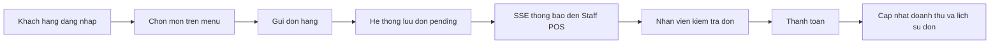
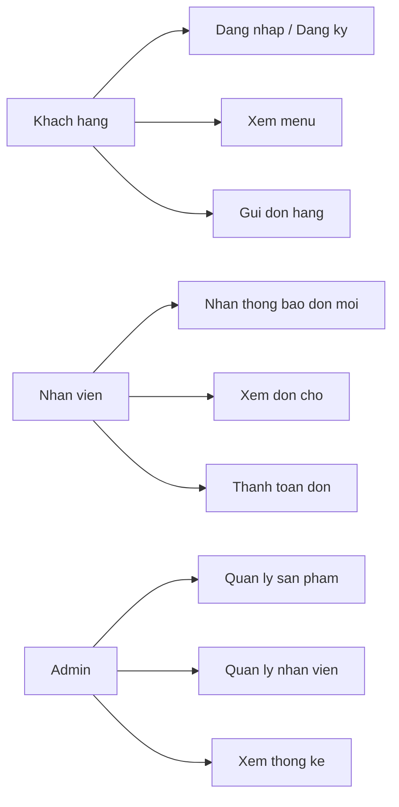
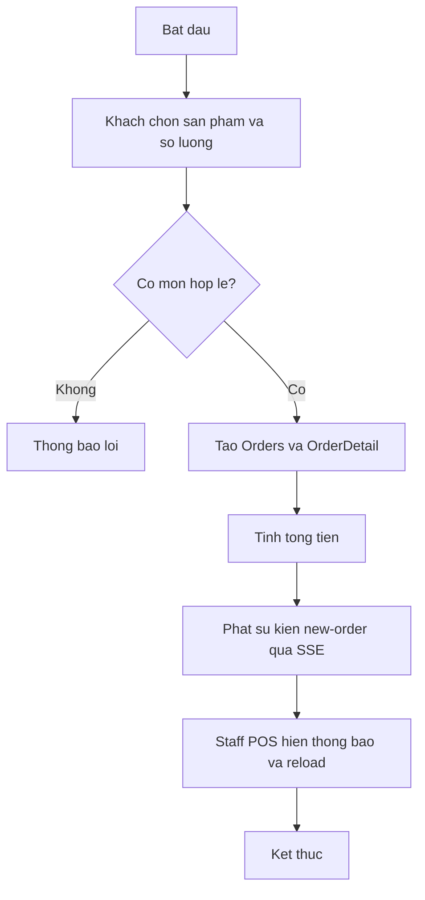
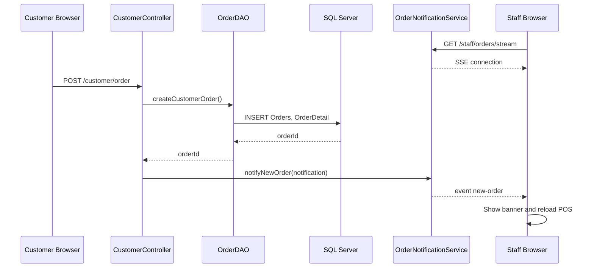
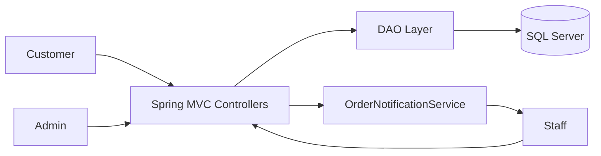
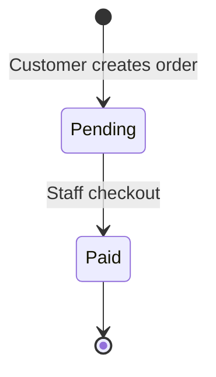
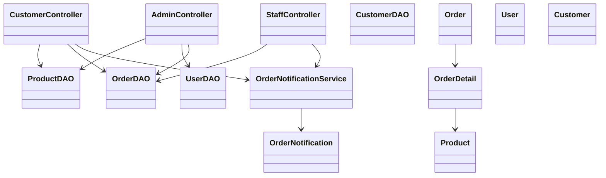
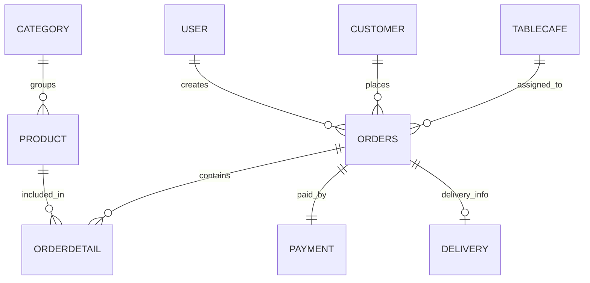

# Software Design Specification - Cafe Management Web

## 1. Gioi thieu du an

### 1.1 Ten du an

Cafe Management Web - He thong quan ly quan cafe.

### 1.2 Muc tieu

- Xay dung ung dung web bang Java Spring Boot de quan ly menu, nhan vien, khach hang va don hang.
- Ap dung mo hinh MVC, ket noi SQL Server bang JDBC, su dung Thymeleaf de hien thi giao dien.
- Bo sung tinh nang nang cao: thong bao don hang realtime cho nhan vien bang Server-Sent Events (SSE).
- Ho tro demo quy trinh thuc te: khach hang dang nhap, dat mon, nhan vien nhan thong bao va thanh toan don.

### 1.3 Pham vi

He thong tap trung vao nghiep vu quan cafe nho:

- Admin quan ly san pham, danh muc, tai khoan nhan vien va xem thong ke.
- Khach hang xem menu va gui don takeaway.
- Nhan vien theo doi don cho, nhan thong bao realtime va xac nhan thanh toan.

Ngoai pham vi hien tai:

- Tich hop cong thanh toan that.
- Quan ly ton kho chi tiet.
- Ung dung mobile rieng.

### 1.4 Cong nghe su dung

- Java 21.
- Spring Boot 3.3.5.
- Spring MVC, Thymeleaf, Bean Validation.
- JDBC, SQL Server, stored procedure, trigger va function.
- HTML, CSS, JavaScript, Server-Sent Events.
- Maven, JUnit 5.

## 2. Ke hoach du an

### 2.1 Pham vi va muc tieu

Muc tieu giai doan hien tai la hoan thien web app quan ly cafe va chung minh mot ky thuat nang cao bang tinh nang realtime notification.

### 2.2 Co cau nhom va phan cong

| Thanh vien | Vai tro | Nhiem vu |
| --- | --- | --- |
| Thanh vien 1 - MSSV | Nhom truong | Lap ke hoach, tong hop bao cao, thiet ke nghiep vu |
| Thanh vien 2 - MSSV | Backend developer | Controller, DAO, ket noi SQL Server, SSE service |
| Thanh vien 3 - MSSV | Frontend developer | Thymeleaf, CSS, man hinh admin/customer/staff |
| Thanh vien 4 - MSSV | Tester/Documentation | Test cases, demo script, SDS diagrams |

### 2.3 Quy trinh phat trien

- Mo hinh SDLC: Iterative/Incremental.
- Giai doan 1: Phan tich nghiep vu, thiet ke database, giao dien chinh va tai lieu ban thao.
- Giai doan 2: Cai dat chuc nang, bo sung realtime notification, kiem thu, hoan thien SDS va demo.

### 2.4 Cong cu su dung

- IDE: IntelliJ IDEA/VS Code/NetBeans.
- Build: Maven.
- DBMS: Microsoft SQL Server.
- Version/report: Markdown, classroom submission.

### 2.5 Ke hoach kiem thu

- Unit test cho service thong bao realtime.
- Manual test theo luong admin, staff va customer.
- Kiem tra ket noi database, stored procedure, dang nhap, dat mon va thanh toan.

## 3. Mo hinh hoa nghiep vu

### 3.1 Quy trinh thuc te

1. Khach hang dang nhap bang so dien thoai.
2. Khach hang xem menu, chon so luong mon va gui don.
3. He thong luu don vao SQL Server voi trang thai `pending`.
4. He thong gui thong bao realtime den man hinh POS cua nhan vien.
5. Nhan vien kiem tra chi tiet don va xac nhan thanh toan.
6. He thong cap nhat trang thai don thanh `paid` va ghi nhan payment.
7. Admin xem doanh thu va danh sach don gan day.

### 3.2 BPM

## 4. Mo hinh hoa chuc nang

### 4.1 Use Case tong quat

### 4.2 Activity - Dat mon va thong bao realtime

### 4.3 Sequence - Realtime order notification

### 4.4 Data Flow Diagram

### 4.5 State machine - Trang thai don hang

## 5. Mo hinh hoa cau truc va thiet ke du lieu

### 5.1 Class Diagram

### 5.2 ERD

### 5.3 Anh xa thuc the

- `Customer` table anh xa thanh `Customer.java`.
- `User` table anh xa thanh `User.java`, phan quyen `admin` va `staff`.
- `Product` va `Category` anh xa thanh menu hien thi cho customer/admin.
- `Orders` va `OrderDetail` anh xa thanh don hang va chi tiet don.
- `Payment` luu thong tin thanh toan khi staff xac nhan.

## 6. Thiet ke va cai dat he thong

### 6.1 Kien truc MVC

- Controller: nhan request, kiem tra session, dieu huong view va goi DAO/service.
- Model: cac lop Java POJO dai dien du lieu nghiep vu.
- DAO: truy van SQL Server bang JDBC, goi stored procedure va cau SQL truc tiep.
- View: Thymeleaf template cho login, admin dashboard, customer menu va staff POS.
- Service nang cao: `OrderNotificationService` quan ly SSE emitters va phat su kien don moi.

### 6.2 Chi tiet tang xu ly

- `LoginController`: dang nhap staff/customer, dang ky customer, logout.
- `CustomerController`: hien menu, tao don hang va phat notification.
- `StaffController`: hien don cho, thanh toan don, mo SSE stream.
- `AdminController`: thong ke, quan ly san pham va nhan vien.
- `OrderDAO`: tao don, them chi tiet, thanh toan va lay doanh thu.

### 6.3 Ky thuat nang cao - Server-Sent Events

Ly do chon SSE:

- Phu hop voi bai toan server day thong bao mot chieu den staff.
- Nhe hon WebSocket cho tinh nang don moi.
- De demo tren trinh duyet bang `EventSource`.

Luong xu ly:

1. Staff mo `/staff/pos`, JavaScript tao `EventSource("/staff/orders/stream")`.
2. `StaffController` kiem tra session staff/admin va dang ky emitter.
3. Customer gui don thanh cong.
4. `CustomerController` tao `OrderNotification` va goi `notifyNewOrder`.
5. Staff browser nhan event `new-order`, hien banner va reload danh sach don.

## 7. Kiem thu

| Test case | Buoc thuc hien | Ket qua mong doi |
| --- | --- | --- |
| Dang nhap staff | Nhap username/password hop le | Dieu huong den `/staff/pos` |
| Customer dat mon | Chon it nhat mot mon va gui don | Don moi duoc tao voi trang thai pending |
| Realtime notification | Staff mo POS, customer gui don | POS hien thong bao don moi va cap nhat danh sach |
| Thanh toan don | Staff chon phuong thuc va xac nhan | Don chuyen sang paid, Payment duoc tao |
| Quan ly san pham | Admin them/an san pham | Menu cap nhat theo trang thai san pham |
| Unit test SSE | Chay `mvn test` | Service subscribe va xu ly emitter loi khong crash |

## 8. Ket qua va tong ket

### 8.1 Ket qua dat duoc

- Hoan thanh web app quan ly cafe voi ba nhom nguoi dung: admin, staff, customer.
- Co dashboard, menu dat mon, POS thanh toan va database SQL Server.
- Bo sung notification realtime bang SSE cho don hang moi.
- Co unit test cho service realtime va tai lieu SDS kem so do.

### 8.2 Danh gia

He thong dap ung yeu cau cot loi cua mon Cong nghe Java: Spring Boot MVC, ket noi CSDL, xu ly nghiep vu, giao dien web va mot tinh nang nang cao co tinh ung dung thuc te.

### 8.3 Rut kinh nghiem

- Can tach service layer ro hon neu du an tiep tuc mo rong.
- Nen ma hoa mat khau va them Spring Security cho phien ban sau.
- Can bo sung test tich hop voi database test rieng.

### 8.4 Huong phat trien

- Tich hop thanh toan online.
- Them xuat bao cao PDF/Excel.
- Them cache cho menu san pham.
- Them delivery tracking va dashboard realtime cho admin.
